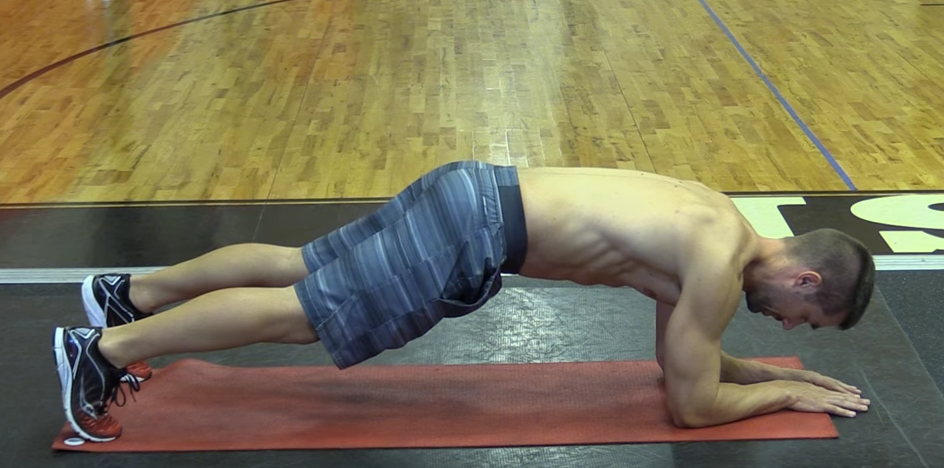

title: 马拉松训练准备
category: 笔记
tags:
  - 马拉松
date: 2016-11-14
toc: true
---

 
 
 

## 简述
* 想用用四个月时间准备半程马拉松不知道够不够。前段时间有尝试跑步，但发现下肢力量不够，容易导致膝盖或脚踝受伤。网上学习资料很多，这篇用于记录总结个人备跑训练(局限于能接触的器材)。
* 篇幅组织：
  - 热身备忘
  - 下肢训练
  - 核心训练
  - 跑步计划
* 个人情况：
  - 身高175cm 体重60kg
  - 平均跑 5-6 km 就很累了
  - 左脚踝伤，右膝盖伤 (2016-11-03)
  - 上身较下身单薄

## 热身备忘
* Single Leg Squat
 

 
 

## 下肢训练

## 核心训练

## 训练计划

